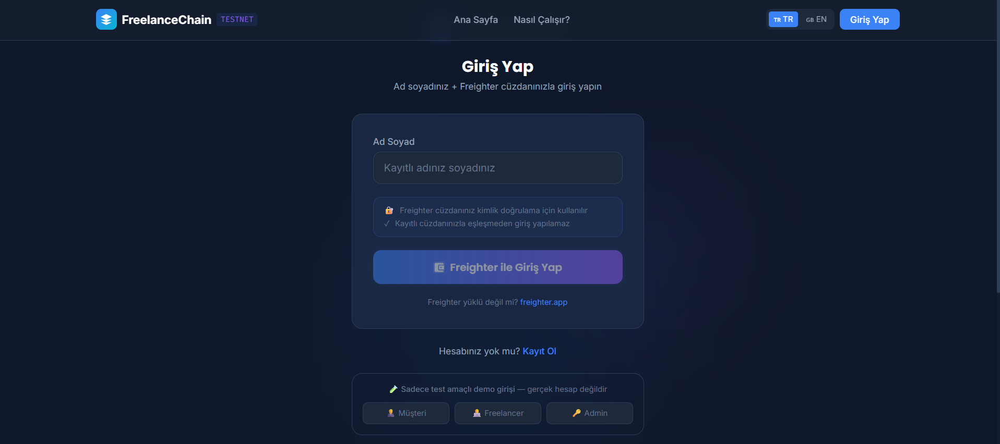
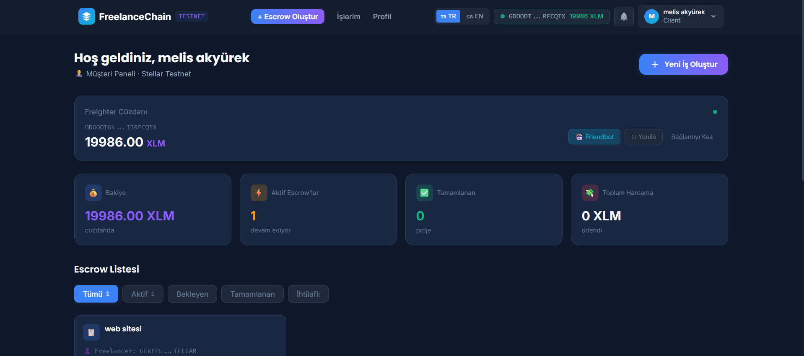
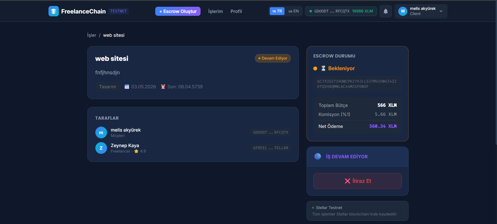
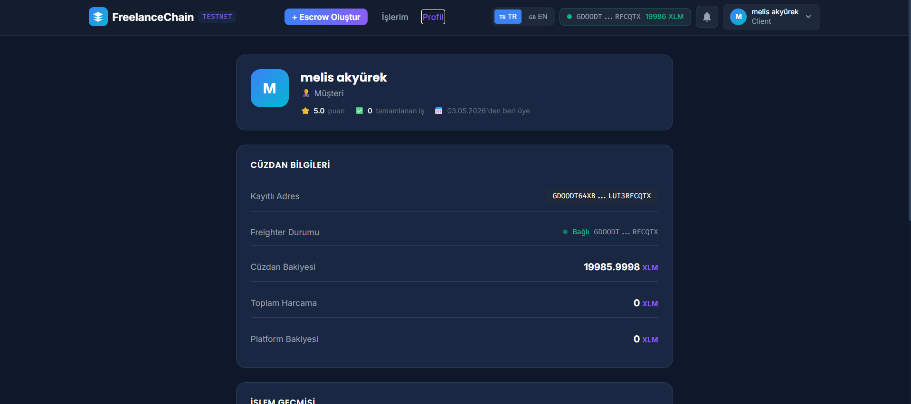

# FreelanceChain

> A blockchain-powered freelance escrow platform built on **Stellar Testnet**.  
> Clients lock XLM into escrow, freelancers complete the work, and funds are released automatically — with a built-in dispute resolution system and admin panel.

---

## Table of Contents

- [Screenshots](#screenshots)
- [Overview](#overview)
- [Features](#features)
- [Tech Stack](#tech-stack)
- [Project Structure](#project-structure)
- [Getting Started](#getting-started)
- [Demo Accounts](#demo-accounts)
- [Escrow Flow](#escrow-flow)
- [Transaction Hashes](#transaction-hashes)
- [API Reference](#api-reference)
- [Roles & Permissions](#roles--permissions)
- [Environment Variables](#environment-variables)

---

## Screenshots

| Screen | Preview |
|---|---|
| 🏠 Landing Page |  |
| 📊 Client Dashboard |  |
| 📋 Job Detail — Escrow Actions |  |
| 🔑 Admin Panel |  |

---

## Overview

FreelanceChain replaces trust-based payment agreements with a transparent escrow mechanism on the Stellar blockchain. Neither party can access the funds until the work is approved — and if there's a disagreement, an admin steps in to decide.

The platform runs entirely on **Stellar Testnet** and uses **Freighter** as the browser wallet. No real XLM is required.

---

## Features

### For Clients
- Create job listings with XLM budget and deadline
- Fund escrow directly from Freighter wallet
- Accept or reject freelancer applicants
- Approve delivered work to release payment
- Open a dispute if work is unsatisfactory
- Download invoice after completion

### For Freelancers
- Browse and apply to available jobs
- Submit completed work with a delivery note
- Respond to disputes opened against you
- Track earnings and completed job history

### For Admins
- View platform-wide stats (volume, commissions, active disputes)
- Inspect and resolve open disputes (pay freelancer / refund client)
- Send in-platform notifications to dispute parties
- Manage all users, jobs, and transactions

### Platform
- Real-time notification polling (every 15 seconds)
- Toast pop-ups for new events while the app is open
- Persistent wallet alert banner when Freighter is disconnected
- Automatic 403 / 401 error handling across all API calls
- Double-click star burst animation on any page
- Fully responsive — works on mobile and desktop

---

## Tech Stack

| Layer | Technology |
|---|---|
| Frontend | React 18, TypeScript, Vite 5 |
| Styling | Tailwind CSS 3, custom design tokens |
| Charts | Recharts |
| Notifications | react-hot-toast |
| Routing | React Router v6 |
| i18n | react-i18next (TR / EN) |
| Wallet | Stellar Freighter API |
| Stellar SDK | @stellar/stellar-sdk v13 |
| Backend | Node.js, Express, TypeScript |
| Auth | JWT (jsonwebtoken) + bcryptjs |
| Database | JSON flat-file (`backend/data/db.json`) |
| Process runner | ts-node-dev |

---

## Project Structure

```
freelancechain/
├── install.bat          ← one-click dependency install (Windows)
├── start.bat            ← one-click start both servers (Windows)
├── screenshots/         ← add your screenshots here
│
├── frontend/
│   ├── src/
│   │   ├── api/         ← Axios client + TypeScript types
│   │   ├── components/  ← Navbar, Footer, EscrowCard, WalletAlert, StarBurst …
│   │   ├── context/     ← AuthContext, WalletContext
│   │   ├── hooks/       ← useNotifications
│   │   ├── pages/       ← Landing, Login, Register, Dashboard, JobDetail …
│   │   │   └── dashboard/   ← ClientDashboard, FreelancerDashboard
│   │   ├── stellar/     ← Freighter helpers, escrow helpers
│   │   └── utils/       ← alerts.ts (centralised toast helpers)
│   ├── tailwind.config.js
│   └── vite.config.ts
│
└── backend/
    ├── src/
    │   ├── db/          ← schema.ts, db.json (auto-created)
    │   ├── middleware/  ← authMiddleware, adminMiddleware
    │   ├── routes/      ← auth, jobs, disputes, admin, notifications
    │   └── stellar/     ← escrow.ts (Stellar SDK helpers)
    └── tsconfig.json
```

---

## Getting Started

### Prerequisites

- **Node.js** v18 or higher
- **npm** v9 or higher
- **Freighter** browser extension — [freighter.app](https://www.freighter.app/)  
  *(Switch Freighter to Testnet before connecting)*

### Installation

**Windows (one command):**
```bat
install.bat
```

**Manual:**
```bash
# Backend
cd backend
npm install

# Frontend
cd ../frontend
npm install
```

### Running the App

**Windows (one command — opens both servers + browser):**
```bat
start.bat
```

**Manual (two terminals):**
```bash
# Terminal 1 — Backend (port 3002)
cd backend
npm run dev

# Terminal 2 — Frontend (port 5173)
cd frontend
npm run dev
```

Then open [http://localhost:5173](http://localhost:5173).

### Health Check
```
GET http://localhost:3002/api/health
```

---

## Demo Accounts

| Role | Email | Password |
|---|---|---|
| Client | `musteri@demo.com` | `demo123` |
| Freelancer | `freelancer@demo.com` | `demo123` |
| Admin | `admin@escrow.com` | `admin123` |

> These accounts are seeded automatically on first run.  
> Connect Freighter wallet after logging in to enable escrow actions.

---

## Escrow Flow

```
Client creates job
       │
       ▼
  [CREATED]  ──── Client funds escrow (Freighter) ────▶  [FUNDED]
                                                              │
                                          Client accepts freelancer
                                                              │
                                                              ▼
                                                       [IN_PROGRESS]
                                                              │
                                              Freelancer submits work
                                                              │
                                                              ▼
                                                       [SUBMITTED]
                                                         /        \
                                              Client approves    Client disputes
                                                   /                    \
                                                  ▼                      ▼
                                           [COMPLETED]             [DISPUTED]
                                        XLM → Freelancer          Funds frozen
                                        (1% commission)                 │
                                                               Admin reviews
                                                               /           \
                                                              ▼             ▼
                                                    Pay Freelancer    Refund Client
                                                       [COMPLETED]    [CANCELLED]
```

---

## Transaction Hashes

All on-chain operations produce a **Stellar transaction hash** — a 64-character hex string that uniquely identifies the transaction on the network. Hashes are stored in `backend/data/db.json` and returned in API responses.

### Live Test Transaction

This transaction was executed against **Stellar Testnet** during development:

| Field | Value |
|---|---|
| **Sender** | `GBYORNQXQXIQONI547GWWSDKEXB6FEM525XTCZCAITQEDH7KUMUM5GLH` |
| **Receiver** | `GAZHS6TTWU5Y5NFB6HEHRR7R4W5D5WHK5F5DJEKWLZSIMRTMFXRF5WLL` |
| **Amount** | 50 XLM |
| **Network** | Stellar Testnet |
| **TX Hash** | `c71dc0451404987baf57fe2f1405b94c74ca7792d675b6b71582087cccf683cf` |
| **Explorer** | [View on Stellar Expert ↗](https://stellar.expert/explorer/testnet/tx/c71dc0451404987baf57fe2f1405b94c74ca7792d675b6b71582087cccf683cf) |

### Hash Formats

| Mode | Example |
|---|---|
| **Live Testnet** | `c71dc0451404987baf57fe2f1405b94c74ca7792d675b6b71582087cccf683cf` |
| **Demo fallback** | `DEMO_1716900123456_A3FX9KZ2` |

> The backend attempts a real Stellar Testnet transaction first. If the escrow keypair is a demo key, it falls back to a simulated hash so the UI always works without a funded Freighter wallet.

### Transaction Types

| Type | Trigger | Who receives |
|---|---|---|
| `escrow_fund` | Client funds the job | Escrow account |
| `release_payment` | Client approves work | Freelancer (99%) + Platform (1%) |
| `refund` | Admin resolves → refund client | Client (100%) |
| `partial_payment` | Admin resolves → split | Freelancer (x%) + Client (100−x%) |

---

## API Reference

All endpoints are prefixed with `/api`.

### Auth — `/api/auth`

| Method | Path | Auth | Description |
|---|---|---|---|
| POST | `/register` | — | Register new user |
| POST | `/login` | — | Login, returns JWT |
| GET | `/me` | ✓ | Get current user |
| PUT | `/wallet` | ✓ | Update wallet address |
| GET | `/transactions` | ✓ | User's transaction history |

### Jobs — `/api/jobs`

| Method | Path | Auth | Description |
|---|---|---|---|
| GET | `/` | ✓ | List jobs (role-filtered) |
| POST | `/` | Client | Create job |
| GET | `/:id` | ✓ | Job detail |
| POST | `/:id/fund` | Client | Fund escrow |
| POST | `/:id/apply` | Freelancer | Apply to job |
| POST | `/:id/accept/:freelancerId` | Client | Accept freelancer |
| POST | `/:id/submit` | Freelancer | Submit work |
| POST | `/:id/approve` | Client | Approve → release payment |

### Disputes — `/api/disputes`

| Method | Path | Auth | Description |
|---|---|---|---|
| GET | `/` | ✓ | List disputes (role-filtered) |
| GET | `/:id` | ✓ | Dispute detail |
| POST | `/` | Client/Freelancer | Open dispute |
| POST | `/:id/respond` | Freelancer | Submit response |
| POST | `/:id/resolve` | Admin | Resolve dispute |

### Admin — `/api/admin`

| Method | Path | Auth | Description |
|---|---|---|---|
| GET | `/stats` | Admin | Platform statistics |
| GET | `/users` | Admin | All users |
| GET | `/jobs` | Admin | All jobs |
| GET | `/disputes` | Admin | All disputes (with wallets) |
| POST | `/disputes/:id/resolve` | Admin | Resolve dispute |
| POST | `/disputes/:id/notify` | Admin | Notify both parties |
| GET | `/transactions` | Admin | All transactions |

### Notifications — `/api/notifications`

| Method | Path | Auth | Description |
|---|---|---|---|
| GET | `/` | ✓ | Get notifications |
| PUT | `/:id/read` | ✓ | Mark one as read |
| PUT | `/read-all` | ✓ | Mark all as read |

---

## Roles & Permissions

| Action | Client | Freelancer | Admin |
|---|---|---|---|
| Create job | ✅ | ❌ | ❌ |
| Fund escrow | ✅ | ❌ | ❌ |
| Apply to job | ❌ | ✅ | ❌ |
| Submit work | ❌ | ✅ | ❌ |
| Approve work | ✅ | ❌ | ❌ |
| Open dispute | ✅ | ✅ | ❌ |
| Respond to dispute | ❌ | ✅ | ❌ |
| Resolve dispute | ❌ | ❌ | ✅ |
| View all users/jobs | ❌ | ❌ | ✅ |
| Send notifications | ❌ | ❌ | ✅ |

---

## Environment Variables

### Backend (`backend/.env`)

```env
PORT=3002
JWT_SECRET=your_jwt_secret_here
```

> If `.env` is not present, defaults are used (`PORT=3001`, a hardcoded JWT secret for development).

### Frontend

No `.env` required. The API base URL is set to `/api` (proxied through Vite to `localhost:3002`).

---

## Notes

- The database is a plain JSON file at `backend/data/db.json`. It is created automatically on first run and seeded with demo accounts.
- All Stellar transactions use Testnet. Fund test accounts at [Stellar Laboratory](https://laboratory.stellar.org/#account-creator?network=test) or via the in-app **Test XLM Al** button.
- The 1-hour wallet session timer is enforced client-side via `WalletContext`. Reconnect via Freighter to extend.
- Commission rate is **1%** and is deducted from the freelancer's payout on job completion.
